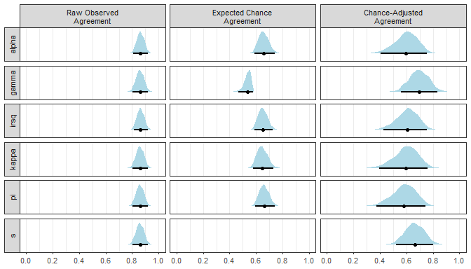

<!-- README.md is generated from README.Rmd. Please edit that file -->

# agreement

<!-- badges: start -->

[](https://www.tidyverse.org/lifecycle/#experimental)
<!-- badges: end -->

The goal of the `agreement` package is to calculate estimates of
inter-rater reliability using generalized formulas and output results in
a tidy dataframe format that makes collecting, bootstrapping, and
plotting them easy. The package includes functions for all major
chance-adjusted indexes of categorical agreement (i.e., S, gamma, kappa,
pi, alpha) as well as all major intraclass correlation coefficients
(i.e., one-way and two-way models, agreement and consistency types, and
single measure and average measure units).

## Installation

You can install the development version from
[GitHub](https://github.com/) with:

``` r
# install.packages("devtools")
devtools::install_github("jmgirard/agreement")
```

## Example

This is a basic example which shows you how to solve a common problem:

``` r
library(agreement)
# Load example dataset with 4 raters assigning 12 objects to 5 unordered categories (and missing values)
data(unordered)
print(unordered)
#> # A tibble: 12 x 4
#>    R1    R2    R3    R4   
#>    <chr> <chr> <chr> <chr>
#>  1 a     a     <NA>  a    
#>  2 b     b     c     b    
#>  3 c     c     c     c    
#>  4 c     c     c     c    
#>  5 b     b     b     b    
#>  6 a     b     c     d    
#>  7 d     d     d     d    
#>  8 a     a     b     a    
#>  9 b     b     b     b    
#> 10 <NA>  e     e     e    
#> 11 <NA>  <NA>  a     a    
#> 12 <NA>  <NA>  c     <NA>
```

``` r
# Calculate the kappa coefficient for unordered categories
nominal <- cat_kappa(unordered)
#> Warning in cat_cai(.data, approach = "kappa", ...): With a small number of
#> objects, bootstrap confidence intervals may not be stable.
summary(nominal, ci = TRUE)
#> 
#> Call:
#> cat_cai(.data = .data, approach = "kappa")
#> 
#> Objects =    12
#> Raters =     4
#> Categories =     {a, b, c, d, e}
#> Weighting =  identity
#> 
#> Chance-Adjusted Categorical Agreement with Bootstrapped CIs
#> 
#>         Observed   Expected   Adjusted   2.5 %   97.5 %
#> kappa      0.818      0.233      0.763   0.457        1
```

``` r
# Transform results into a tidy data frame
tidy(nominal)
#> # A tibble: 3 x 4
#>   approach weighting term     estimate
#>   <chr>    <chr>     <chr>       <dbl>
#> 1 kappa    identity  Observed    0.818
#> 2 kappa    identity  Expected    0.233
#> 3 kappa    identity  Adjusted    0.763
```

``` r
# Plot the bootstrap resampling distribution with 95% CIs
plot(nominal, "Adjusted")
```


``` r
# Load example dataset with 5 raters assigning 20 objects to 4 ordered categories (and missing values)
data(ordered)
print(ordered)
#> # A tibble: 20 x 5
#>       R1    R2    R3    R4    R5
#>    <dbl> <dbl> <dbl> <dbl> <dbl>
#>  1     1     1     2    NA     2
#>  2     1     1     0     1    NA
#>  3     2     3     3     3    NA
#>  4    NA     0     0    NA     0
#>  5     0     0     0    NA     0
#>  6     0     0     0    NA     0
#>  7     1     0     2    NA     1
#>  8     1    NA     2     0    NA
#>  9     2     2     2    NA     2
#> 10     2     1     1     1    NA
#> 11    NA     1     0     0    NA
#> 12     0     0     0     0    NA
#> 13     1     2     2     2    NA
#> 14     3     3     2     2     3
#> 15     1     1     1    NA     1
#> 16     1     1     1    NA     1
#> 17     2     1     2    NA     2
#> 18     1     2     3     3    NA
#> 19     1     1     0     1    NA
#> 20     0     0     0    NA     0
```

``` r
# Calculate pi coefficient for ordered categories (with linear weights)
interval <- cat_pi(ordered, weighting = "linear")
summary(interval, ci = TRUE)
#> 
#> Call:
#> cat_cai(.data = .data, approach = "pi", weighting = "linear")
#> 
#> Objects =    20
#> Raters =     5
#> Categories =     {0, 1, 2, 3}
#> Weighting =  linear
#> 
#> Chance-Adjusted Categorical Agreement with Bootstrapped CIs
#> 
#>      Observed   Expected   Adjusted   2.5 %   97.5 %
#> pi      0.859      0.648      0.601   0.385    0.739
```

``` r
tidy(interval)
#> # A tibble: 3 x 4
#>   approach weighting term     estimate
#>   <chr>    <chr>     <chr>       <dbl>
#> 1 pi       linear    Observed    0.859
#> 2 pi       linear    Expected    0.648
#> 3 pi       linear    Adjusted    0.601
```

``` r
plot(interval, "Adjusted")
```



## Code of Conduct

Please note that the ‘agreement’ project is released with a [Contributor
Code of Conduct](.github/CODE_OF_CONDUCT.md). By contributing to this
project, you agree to abide by its terms.
