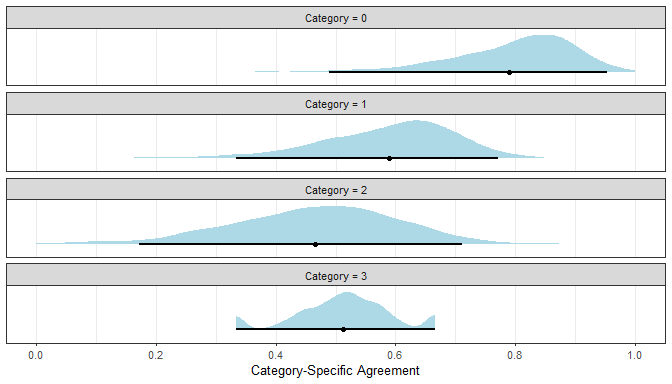

<!-- README.md is generated from README.Rmd. Please edit that file -->

# agreement

<!-- badges: start -->

[](https://www.tidyverse.org/lifecycle/#experimental)
<!-- badges: end -->

The goal of the `agreement` package is to calculate estimates of
inter-rater agreement and reliability using generalized formulas that
accommodate different designs (e.g., crossed or uncrossed), missing
data, and ordered or unordered categories. The package includes
generalized functions for all major chance-adjusted indexes of
categorical agreement (i.e., \(\alpha\), \(\gamma\), \(I_r^2\),
\(\kappa\), \(\pi\), and \(S\)) as well as all major intraclass
correlation coefficients (i.e., one-way and two-way models, agreement
and consistency types, and single measure and average measure units).
Estimates include bootstrap resampling distributions, confidence
intervals, and custom tidying and plotting functions.

## Installation

You can install the development version from
[GitHub](https://github.com/) with:

``` r
# install.packages("devtools")
devtools::install_github("jmgirard/agreement")
```

## Example

Calculate chance-adjusted indexes of categorical agreement for unordered
categories

``` r
library(agreement)
# Load dataset with 4 raters assigning 12 objects to 5 unordered categories
data(unordered)
print(unordered)
#> # A tibble: 12 x 4
#>    R1    R2    R3    R4   
#>    <chr> <chr> <chr> <chr>
#>  1 a     a     <NA>  a    
#>  2 b     b     c     b    
#>  3 c     c     c     c    
#>  4 c     c     c     c    
#>  5 b     b     b     b    
#>  6 a     b     c     d    
#>  7 d     d     d     d    
#>  8 a     a     b     a    
#>  9 b     b     b     b    
#> 10 <NA>  e     e     e    
#> 11 <NA>  <NA>  a     a    
#> 12 <NA>  <NA>  c     <NA>
```

``` r
# Calculate all chance-adjusted indexes for unordered categories
results1 <- cat_adjusted(unordered)
#> Warning in cat_adjusted(unordered): With a small number of objects, bootstrap
#> confidence intervals may not be stable.
summary(results1, ci = TRUE)
#> 
#> Call:
#> cat_adjusted(.data = unordered)
#> 
#> Objects =    12
#> Raters =     4
#> Categories =     {a, b, c, d, e}
#> Weighting =  identity
#> 
#> Chance-Adjusted Categorical Agreement with Bootstrapped CIs
#> 
#>         Observed   Expected   Adjusted   2.5 %   97.5 %
#> alpha      0.805      0.240      0.743   0.425        1
#> gamma      0.818      0.190      0.775   0.541        1
#> irsq       0.818      0.233      0.763   0.476        1
#> kappa      0.818      0.233      0.763   0.479        1
#> pi         0.818      0.239      0.761   0.458        1
#> s          0.818      0.200      0.773   0.531        1
```

``` r
# Transform results into a tidy data frame
tidy(results1)
#> # A tibble: 18 x 6
#>    approach weighting term     estimate lower upper
#>    <chr>    <chr>     <chr>       <dbl> <dbl> <dbl>
#>  1 alpha    identity  Observed    0.805 0.600 1.00 
#>  2 gamma    identity  Observed    0.818 0.625 1    
#>  3 irsq     identity  Observed    0.818 0.625 1    
#>  4 kappa    identity  Observed    0.818 0.625 1    
#>  5 pi       identity  Observed    0.818 0.625 1    
#>  6 s        identity  Observed    0.818 0.625 1    
#>  7 alpha    identity  Expected    0.24  0.216 0.435
#>  8 gamma    identity  Expected    0.190 0.144 0.196
#>  9 irsq     identity  Expected    0.233 0.214 0.385
#> 10 kappa    identity  Expected    0.233 0.202 0.420
#> 11 pi       identity  Expected    0.239 0.218 0.424
#> 12 s        identity  Expected    0.2   0.2   0.2  
#> 13 alpha    identity  Adjusted    0.743 0.425 1    
#> 14 gamma    identity  Adjusted    0.775 0.541 1    
#> 15 irsq     identity  Adjusted    0.763 0.476 1    
#> 16 kappa    identity  Adjusted    0.763 0.479 1    
#> 17 pi       identity  Adjusted    0.761 0.458 1    
#> 18 s        identity  Adjusted    0.773 0.531 1
```

``` r
# Plot the bootstrap resampling distributions with confidence intervals
plot(results1)
```


Calculate chance-adjusted indexes of categorical agreement for ordered
categories

``` r
# Load dataset with 5 raters assigning 20 objects to 4 ordered categories
data(ordered)
print(ordered)
#> # A tibble: 20 x 5
#>       R1    R2    R3    R4    R5
#>    <dbl> <dbl> <dbl> <dbl> <dbl>
#>  1     1     1     2    NA     2
#>  2     1     1     0     1    NA
#>  3     2     3     3     3    NA
#>  4    NA     0     0    NA     0
#>  5     0     0     0    NA     0
#>  6     0     0     0    NA     0
#>  7     1     0     2    NA     1
#>  8     1    NA     2     0    NA
#>  9     2     2     2    NA     2
#> 10     2     1     1     1    NA
#> 11    NA     1     0     0    NA
#> 12     0     0     0     0    NA
#> 13     1     2     2     2    NA
#> 14     3     3     2     2     3
#> 15     1     1     1    NA     1
#> 16     1     1     1    NA     1
#> 17     2     1     2    NA     2
#> 18     1     2     3     3    NA
#> 19     1     1     0     1    NA
#> 20     0     0     0    NA     0
```

``` r
# Calculate all chance-adjusted indexes for ordered categories (linear weights)
results2 <- cat_adjusted(ordered, weighting = "linear")
summary(results2, ci = TRUE)
#> 
#> Call:
#> cat_adjusted(.data = ordered, weighting = "linear")
#> 
#> Objects =    20
#> Raters =     5
#> Categories =     {0, 1, 2, 3}
#> Weighting =  linear
#> 
#> Chance-Adjusted Categorical Agreement with Bootstrapped CIs
#> 
#>         Observed   Expected   Adjusted   2.5 %   97.5 %
#> alpha      0.864      0.643      0.618   0.404    0.753
#> gamma      0.859      0.553      0.686   0.558    0.834
#> irsq       0.859      0.638      0.612   0.395    0.754
#> kappa      0.859      0.636      0.614   0.394    0.762
#> pi         0.859      0.648      0.601   0.375    0.746
#> s          0.859      0.583      0.663   0.523    0.803
```

``` r
tidy(results2)
#> # A tibble: 18 x 6
#>    approach weighting term     estimate lower upper
#>    <chr>    <chr>     <chr>       <dbl> <dbl> <dbl>
#>  1 alpha    linear    Observed    0.864 0.810 0.919
#>  2 gamma    linear    Observed    0.859 0.801 0.918
#>  3 irsq     linear    Observed    0.859 0.801 0.918
#>  4 kappa    linear    Observed    0.859 0.801 0.918
#>  5 pi       linear    Observed    0.859 0.801 0.918
#>  6 s        linear    Observed    0.859 0.801 0.918
#>  7 alpha    linear    Expected    0.643 0.587 0.740
#>  8 gamma    linear    Expected    0.553 0.467 0.575
#>  9 irsq     linear    Expected    0.638 0.586 0.726
#> 10 kappa    linear    Expected    0.636 0.576 0.732
#> 11 pi       linear    Expected    0.648 0.592 0.741
#> 12 s        linear    Expected    0.583 0.583 0.583
#> 13 alpha    linear    Adjusted    0.618 0.404 0.753
#> 14 gamma    linear    Adjusted    0.686 0.558 0.834
#> 15 irsq     linear    Adjusted    0.612 0.395 0.754
#> 16 kappa    linear    Adjusted    0.614 0.394 0.762
#> 17 pi       linear    Adjusted    0.601 0.375 0.746
#> 18 s        linear    Adjusted    0.663 0.523 0.803
```

``` r
plot(results2)
```


Calculate category-specific agreement

``` r
# Calculate category-specific agreement
results3 <- cat_specific(ordered)
summary(results3, ci = TRUE)
#> 
#> Call:
#> cat_specific(.data = ordered)
#> 
#> Objects =    20
#> Raters =     5
#> Categories =     {0, 1, 2, 3}
#> 
#> Category-Specific Agreement with Bootstrapped CIs
#> 
#>     Estimate   2.5 %   97.5 %
#> 0      0.812   0.490    0.954
#> 1      0.605   0.333    0.771
#> 2      0.483   0.171    0.711
#> 3      0.519   0.333    0.667
```

``` r
tidy(results3)
#> # A tibble: 4 x 4
#>   category estimate lower upper
#>      <dbl>    <dbl> <dbl> <dbl>
#> 1        0    0.812 0.490 0.954
#> 2        1    0.605 0.333 0.771
#> 3        2    0.483 0.171 0.711
#> 4        3    0.519 0.333 0.667
```

``` r
plot(results3)
```



Calculate intraclass correlation coefficient for dimensional data

``` r
# Load dataset with 4 raters rating 15 objects in 1 trial
data(lungfun2)
print(lungfun2)
#> # A tibble: 60 x 4
#>    Trial Object Rater Score
#>    <dbl>  <int> <chr> <dbl>
#>  1     1      1 R1      190
#>  2     1      1 R2      220
#>  3     1      1 R3      200
#>  4     1      1 R4      200
#>  5     1      2 R1      220
#>  6     1      2 R2      200
#>  7     1      2 R3      240
#>  8     1      2 R4      230
#>  9     1      3 R1      260
#> 10     1      3 R2      260
#> # … with 50 more rows
```

``` r
# Calculate average score ICC using Model 1A
results4 <- dim_icc(lungfun2, Object, Rater, Score, Trial, 
  model = "1A", type = "agreement", k = 4, warnings = FALSE)
summary(results4)
#> 
#> Intraclass Correlation Coefficient Analysis Details
#> 
#> Number of Objects    15
#> Number of Raters     4
#> Number of Trials     1
#> 
#> Score Missingness    0.000 %
#> Score Number Range   [190, 375]
#> 
#> ICC Model            Model 1A
#> ICC Type             Agreement
#> ICC Index            Average of 4 Raters
#> 
#> Variance Component Estimates with Bootstrapped CIs
#> 
#>                     Estimate     2.5 %     97.5 %
#> Object Variance     1415.913   418.430   2477.863
#> Residual Variance    468.194   154.708    909.378
#> 
#> ICC Estimates with Bootstrapped CIs
#> 
#>                   Estimate   2.5 %   97.5 %
#> Inter-Rater ICC      0.924   0.713    0.977
```

``` r
tidy(results4)
#> # A tibble: 3 x 4
#>   term              estimate   lower    upper
#>   <chr>                <dbl>   <dbl>    <dbl>
#> 1 Object Variance   1416.    418.    2478.   
#> 2 Residual Variance  468.    155.     909.   
#> 3 Inter-Rater ICC      0.924   0.713    0.977
```

``` r
plot(results4, intra = FALSE, inter = TRUE)
```


## Code of Conduct

Please note that the ‘agreement’ project is released with a [Contributor
Code of Conduct](.github/CODE_OF_CONDUCT.md). By contributing to this
project, you agree to abide by its terms.
